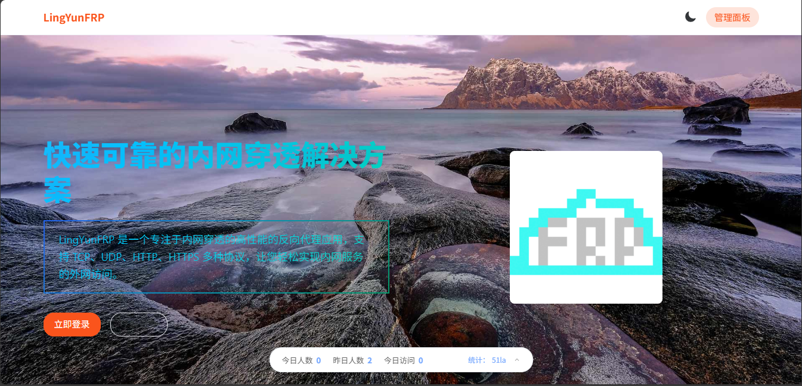
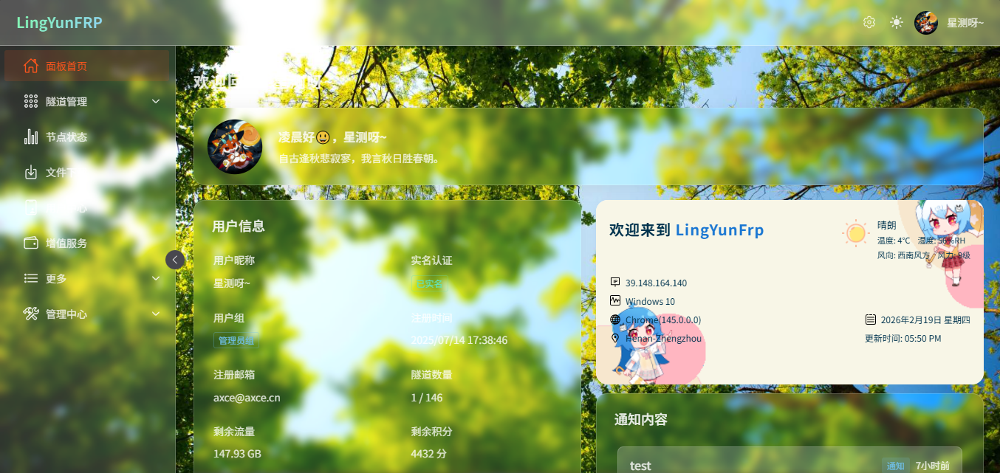

# LingYunFRP 面板前端

<p align="center">
  
</p>

<p align="center">
  
</p>

<p align="center">
  <a href="https://img.shields.io/github/last-commit/YCLY-IT/LingYunFrp-Panel-Frontend?style=flat-square"></a>
  <a href="https://img.shields.io/github/license/YCLY-IT/LingYunFrp-Panel-Frontend?style=flat-square"></a>
  <a href="https://img.shields.io/github/issues/YCLY-IT/LingYunFrp-Panel-Frontend?style=flat-square"></a>
  <a href="https://img.shields.io/github/stars/YCLY-IT/LingYunFrp-Panel-Frontend?style=flat-square"></a>
</p>

---

## 项目简介

**LingYunFRP（凌云FRP）** 是一款高性能、易用的内网穿透与反向代理服务管理面板，支持多协议（TCP/UDP/HTTP/HTTPS/STCP/XTCP），为用户和管理员提供丰富的可视化操作界面。

### 核心特性

| 特性            | 描述                                       |
| --------------- | ------------------------------------------ |
| 🚀 移动端自适应 | 无论手机、平板还是PC都能流畅访问和操作     |
| 🌈 现代化UI     | 基于 Naive UI，体验美观且易用              |
| 🔒 多重安全机制 | 保障数据与账户安全                         |
| 🛠️ 丰富管理功能 | 满足个人与企业多样化需求                   |
| 🎨 主题定制     | 支持明暗主题切换、自定义主题色、背景图设置 |
| ♿ 无障碍支持   | 色弱模式、高对比度模式                     |

---

## 快速体验

访问 [凌云FRP](https://www.lyfrp.cn) 立即体验

---

## 技术栈

| 技术                                          | 说明                   |
| --------------------------------------------- | ---------------------- |
| [Vue 3](https://vuejs.org/)                   | 渐进式 JavaScript 框架 |
| [Vite](https://vitejs.dev/)                   | 下一代前端构建工具     |
| [TypeScript](https://www.typescriptlang.org/) | JavaScript 的超集      |
| [Naive UI](https://www.naiveui.com/)          | Vue 3 组件库           |
| [Pinia](https://pinia.vuejs.org/)             | Vue 状态管理           |
| [Axios](https://axios-http.com/)              | HTTP 客户端            |
| [Echarts](https://echarts.apache.org/)        | 数据可视化             |
| [Sass](https://sass-lang.com/)                | CSS 预处理器           |

---

## 目录结构

```text
src/
├── components/          # 公共组件
│   ├── ThemeSwitcher.vue    # 主题切换组件
│   └── ...
├── views/               # 页面视图
│   ├── Dashboard/           # 仪表盘
│   │   ├── admin/           # 管理端
│   │   ├── proxies/         # 隧道管理
│   │   └── more/            # 更多功能
│   ├── Home.vue             # 首页
│   ├── Login.vue            # 登录
│   └── Register.vue         # 注册
├── router/              # 路由配置
├── stores/              # Pinia 状态管理
│   └── theme.ts             # 主题状态
├── assets/              # 静态资源
│   └── styles/              # 全局样式
├── utils/               # 工具函数
│   ├── imageUtils.ts        # 图片处理工具
│   └── useThemeTransition.ts # 主题切换动画
├── constants/           # 常量定义
└── main.ts              # 入口文件
```

---

## 功能模块

### 用户端功能

<details>
<summary>点击展开详情</summary>

| 功能模块  | 描述                               |
| --------- | ---------------------------------- |
| 注册/登录 | 支持验证码、邮箱等多种方式         |
| 首页展示  | 产品介绍、特性、价格方案、常见问题 |
| 仪表盘    | 个人信息、公告、流量统计、通知     |
| 隧道管理  | 创建、编辑、启用/禁用、删除隧道    |
| 节点监控  | 节点在线状态、流量、客户端数       |
| 增值服务  | 流量、隧道、套餐购买               |
| 软件下载  | 多平台客户端、Docker 镜像          |
| 用户中心  | 资料修改、头像、密码、实名认证     |

</details>

### 管理端功能

<details>
<summary>点击展开详情</summary>

| 功能模块 | 描述                               |
| -------- | ---------------------------------- |
| 用户管理 | 搜索、分组、实名、状态、编辑、封禁 |
| 节点管理 | 节点增删改查、状态监控、配置管理   |
| 产品管理 | 套餐、流量、隧道等产品管理         |
| 软件管理 | 客户端软件、版本、下载源管理       |
| 财务管理 | 充值、订单、支付方式               |
| 系统设置 | 公告、全局参数、权限分配           |

</details>

### 主题定制功能

<details>
<summary>点击展开详情</summary>

| 功能       | 描述                                 |
| ---------- | ------------------------------------ |
| 自动主题   | 跟随系统明暗主题自动切换             |
| 手动切换   | 手动切换明暗主题，支持动画效果       |
| 主题色     | 自定义主题色，提供预设颜色选择       |
| 背景图     | 支持本地图片或网络链接，自动压缩优化 |
| 毛玻璃效果 | 背景模糊、毛玻璃模式                 |
| 无障碍     | 色弱模式、高对比度模式               |

**背景图优化特性：**

- 自动压缩大图，限制最大尺寸 1920x1080
- 使用 IndexedDB 存储，突破 localStorage 5MB 限制
- 网络图片自动缓存，避免重复加载
- 加载状态提示，用户体验友好

</details>

---

## 快速开始

### 环境要求

- Node.js >= 18
- npm >= 9 或 pnpm >= 8

### 安装依赖

```bash
npm install
# 或
pnpm install
```

### 开发模式

```bash
npm run dev
# 或
pnpm dev
```

### 构建生产版本

```bash
npm run build
# 或
pnpm build
```

### 预览构建结果

```bash
npm run preview
# 或
pnpm preview
```

### 代码格式化

```bash
npm run format
# 或
pnpm format
```

---

## 配置说明

### 开发服务器

| 配置项  | 默认值                | 说明            |
| ------- | --------------------- | --------------- |
| 端口    | 3001                  | 开发服务器端口  |
| API代理 | /api → localhost:8081 | 后端API代理地址 |

### 修改代理配置

编辑 `vite.config.ts` 文件：

```typescript
server: {
  port: 3001,
  proxy: {
    '/api': {
      target: 'http://your-backend-server:port',
      changeOrigin: true,
    },
  },
}
```

---

## 常见问题

<details>
<summary>如何切换主题？</summary>

支持明暗主题自动切换，可在设置面板中切换或跟随系统设置。

</details>

<details>
<summary>如何自定义主题色？</summary>

在主题设置面板中选择预设颜色或使用颜色选择器自定义。

</details>

<details>
<summary>背景图加载失败怎么办？</summary>

背景图功能已优化：

- 大图会自动压缩
- 使用 IndexedDB 存储，支持更大的图片
- 建议使用小于 10MB 的图片文件
</details>

<details>
<summary>如何切换 API 后端地址？</summary>

修改 `vite.config.ts` 中的 `server.proxy` 配置。

</details>

<details>
<summary>如何自定义 Logo 和名称？</summary>

- 修改 `public/favicon.ico` 更换图标
- 修改 `package.json` 中的 `title` 字段更换名称
</details>

<details>
<summary>移动端支持情况？</summary>

所有页面均已适配移动端，手机、平板访问体验良好。

</details>

---

## 开发推荐

- [VSCode](https://code.visualstudio.com/) - 编辑器
- [Volar](https://marketplace.visualstudio.com/items?itemName=Vue.volar) - Vue 语言支持
- [TypeScript Vue Plugin (Volar)](https://marketplace.visualstudio.com/items?itemName=Vue.vscode-typescript-vue-plugin) - TypeScript 支持

---

## 贡献指南

欢迎任何形式的贡献！

1. Fork 本仓库
2. 创建特性分支 (`git checkout -b feature/AmazingFeature`)
3. 提交更改 (`git commit -m 'Add some AmazingFeature'`)
4. 推送到分支 (`git push origin feature/AmazingFeature`)
5. 提交 Pull Request

---

## 联系方式

| 渠道   | 链接                                                                                                         |
| ------ | ------------------------------------------------------------------------------------------------------------ |
| 官网   | [https://www.ycly.net](https://www.ycly.net)                                                                 |
| 邮箱   | 1263115878@qq.com                                                                                            |
| QQ群   | 882670857                                                                                                    |
| GitHub | [https://github.com/YCLY-IT/LingYunFrp-Panel-Frontend](https://github.com/YCLY-IT/LingYunFrp-Panel-Frontend) |

---

## 许可证

本项目基于 AGPL-3.0 License 开源，详见 [LICENSE](./LICENSE)。

---

<p align="center">
  感谢您的支持！如需更详细的功能说明或遇到问题，欢迎通过上述联系方式反馈。
</p>
