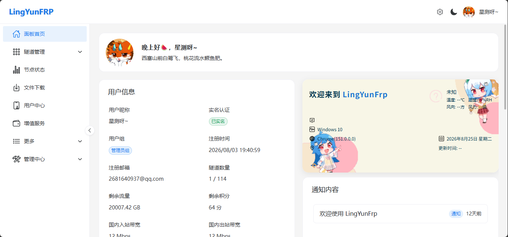

# LingYunFRP 面板前端

凌云FRP 内网穿透服务的 Web 管理面板，包含用户端与管理端界面。




## 技术栈

- Vue 3
- Vite
- TypeScript
- Naive UI
- Pinia
- Axios
- ECharts
- Sass

## 目录结构

```
src/
├── components/      # 公共组件
├── views/          # 页面视图
│   ├── Dashboard/  # 仪表盘（admin 管理端 / proxies 隧道 / more 更多）
│   ├── Home.vue    # 首页
│   ├── Login.vue   # 登录
│   └── Register.vue
├── router/         # 路由
├── stores/         # Pinia 状态（含 theme 主题）
├── assets/styles/  # 全局样式
├── utils/          # 工具函数
├── constants/      # 常量
└── main.ts         # 入口
```

## 功能

**用户端**

- 注册 / 登录（验证码、邮箱）
- 首页：产品介绍、价格方案、常见问题
- 仪表盘：个人信息、公告、流量统计、通知
- 隧道管理：创建、编辑、启用 / 禁用、删除
- 节点监控：在线状态、流量、客户端数
- 增值服务：流量 / 隧道 / 套餐购买
- 软件下载：多平台客户端、Docker 镜像
- 用户中心：资料、头像、密码、实名认证

**管理端**

- 用户管理：搜索、分组、实名、状态、封禁
- 节点管理：增删改查、状态监控、配置
- 产品管理：套餐、流量、隧道
- 软件管理：客户端、版本、下载源
- 财务管理：充值、订单、支付
- 系统设置：公告、参数、权限

**主题**

- 明暗主题自动 / 手动切换
- 自定义主题色
- 背景图（本地或链接，自动压缩至 1920×1080，IndexedDB 存储）
- 毛玻璃效果
- 色弱 / 高对比度模式

## 快速开始

环境要求：Node.js >= 18，pnpm >= 8（或 npm >= 9）。

```bash
pnpm install      # 安装依赖
pnpm dev          # 开发模式
pnpm build        # 构建
pnpm preview      # 预览构建产物
pnpm format       # 代码格式化
```

## 配置

开发服务器默认端口 3001，API 通过代理转发：

| 配置项   | 默认值                |
| -------- | --------------------- |
| 端口     | 3001                  |
| API 代理 | /api → localhost:8081 |

修改 `vite.config.ts` 调整后端地址：

```typescript
server: {
  port: 3001,
  proxy: {
    '/api': {
      target: 'http://your-backend-server:port',
      changeOrigin: true,
    },
  },
}
```

## 常见问题

- **切换 API 后端地址**：修改 `vite.config.ts` 中的 `server.proxy`。
- **更换 Logo / 名称**：替换 `public/favicon.ico`，修改 `package.json` 的 `title` 字段。
- **背景图加载失败**：大图会自动压缩并以 IndexedDB 存储，建议使用小于 10MB 的图片。

## 联系方式

- 官网：https://www.ycly.net
- 邮箱：1263115878@qq.com
- QQ 群：882670857
- GitHub：https://github.com/YCLY-IT/LingYunFrp-Panel-Frontend

## 许可证

AGPL-3.0，详见 [LICENSE](./LICENSE)。
