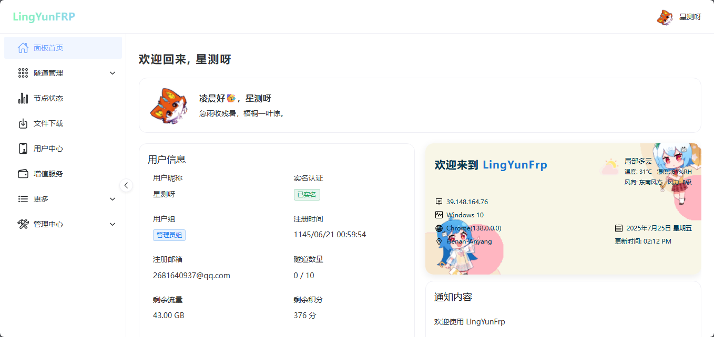

# LingYunFRP 面板前端

<p align="center">
  
</p>

<p align="center">
  
</p>

<p align="center">
  <a href="https://img.shields.io/github/last-commit/YCLY-IT/LingYunFrp-panel-frontend?style=flat-square"></a>
  <a href="https://img.shields.io/github/license/YCLY-IT/LingYunFrp-panel-frontend?style=flat-square"></a>
  <a href="https://img.shields.io/github/issues/YCLY-IT/LingYunFrp-panel-frontend?style=flat-square"></a>
  <a href="https://img.shields.io/github/stars/YCLY-IT/LingYunFrp-panel-frontend?style=flat-square"></a>
</p>

---

## 项目简介

**LingYunFRP（凌云FRP）** 是一款高性能、易用的内网穿透与反向代理服务管理面板，支持多协议（TCP/UDP/HTTP/HTTPS/STCP/XTCP），为用户和管理员提供丰富的可视化操作界面。

- 🚀 **支持移动端自适应**，无论手机、平板还是PC都能流畅访问和操作
- 🌈 **现代化UI**，基于 Naive UI，体验美观且易用
- 🔒 **多重安全机制**，保障数据与账户安全
- 🛠️ **丰富的管理功能**，满足个人与企业多样化需求

---

## 快速体验

1. 访问 [凌云FRP](https://www.lyfrp.cn)

---

## 技术栈

- [Vue 3](https://vuejs.org/) + [Vite](https://vitejs.dev/)
- [TypeScript](https://www.typescriptlang.org/)
- [Naive UI](https://www.naiveui.com/)（UI 组件库）
- [Pinia](https://pinia.vuejs.org/)（状态管理）
- [Axios](https://axios-http.com/)（网络请求）
- 其他：Echarts、highlight.js、moment、Sass 等

---

## 目录结构

```text
├── src/
│   ├── components/         # 公共组件
│   ├── views/              # 主要页面（含 Dashboard、首页、登录注册等）
│   │   ├── Dashboard/      # 仪表盘及子模块
│   │   │   ├── admin/      # 管理端（用户、节点、产品、软件等管理）
│   │   │   ├── proxies/    # 隧道/代理管理
│   │   │   ├── more/       # 更多（如关于页）
│   │   │   └── ...         # 其他子模块
│   │   └── ...             # 其他页面
│   ├── router/             # 路由配置
│   ├── stores/             # Pinia 状态管理
│   ├── assets/             # 静态资源
│   ├── utils/              # 工具函数
│   ├── constants/          # 常量
│   └── main.ts             # 入口文件
├── public/                 # 公共资源
├── package.json            # 项目依赖与脚本
├── vite.config.ts          # Vite 配置
└── README.md               # 项目说明文档
```

---

## 主要功能

### 用户端

- **注册/登录/找回密码**：支持验证码、邮箱等多种方式
- **首页展示**：产品介绍、特性、价格方案、常见问题
- **仪表盘**：个人信息、公告、流量统计、通知
- **代理/隧道管理**：创建、编辑、启用/禁用、删除、查看详情
- **节点状态监控**：节点在线状态、流量、客户端数等
- **增值服务**：流量、隧道、套餐等购买
- **软件下载**：多平台客户端、Docker 镜像下载
- **用户中心**：资料修改、头像、密码、实名认证
- **移动端适配**：所有页面均支持移动端访问，交互友好

### 管理端

- **用户管理**：搜索、分组、实名、状态、编辑、封禁
- **节点管理**：节点增删改查、状态监控、带宽/端口/协议配置
- **产品管理**：套餐、流量、隧道等产品的增删改查
- **软件管理**：客户端软件、版本、下载源管理
- **财务管理**：充值、订单、支付方式
- **系统设置**：公告、全局参数、权限分配

---

## 安装与启动

### 推荐开发环境

- [VSCode](https://code.visualstudio.com/) + [Volar](https://marketplace.visualstudio.com/items?itemName=Vue.volar)

### 安装依赖

```bash
npm install
# 或
pnpm install
```

### 本地开发

```bash
npm run dev
# 或
pnpm dev
```

### 构建生产环境

```bash
npm run build
# 或
pnpm build
```

### 预览构建结果

```bash
npm run preview
# 或
pnpm preview
```

---

## 端口与代理

- 默认开发端口：`3001`
- 本地 API 代理：`/api` 代理到 `http://localhost:8081`
- 静态资源路径已做 hash 处理，便于缓存与版本管理

---

## 常见问题（FAQ）

- **如何切换主题？**  
  支持明暗主题自动切换，可在界面右上角切换或跟随系统。
- **如何添加节点/产品/软件？**  
  管理员登录后在仪表盘左侧菜单进入相应管理页面操作。
- **如何下载客户端？**  
  登录后进入"文件下载"页面，选择系统和架构后即可下载。
- **如何充值/购买服务？**  
  进入"增值服务"页面，选择产品和支付方式后下单。
- **如何切换 API 后端地址？**  
  请在 `vite.config.ts` 的 `server.proxy` 配置中修改目标地址。
- **如何更换主题色？**  
  可在 `src/constants/theme.ts` 中自定义主题色变量。
- **如何自定义 Logo 和名称？**  
  修改 `public/favicon.ico` 及 `package.json` 中的 `title` 字段。
- **移动端支持情况？**  
  所有页面均已适配移动端，手机、平板访问体验良好。

---

## 贡献指南

欢迎任何形式的贡献！你可以：

- 提交 Issue 反馈 bug 或建议
- Fork 并提交 Pull Request
- 优化文档或翻译

---

## 联系方式

- **官网**：[https://www.ycly.net](https://www.ycly.net)
- **邮箱**：1263115878@qq.com
- **QQ群**：882670857
- **GitHub**：[https://github.com/YCLY-IT](https://github.com/YCLY-IT)

---

## 许可证

本项目基于 AGPL-3.0 License 开源，详见 [LICENSE](./LICENSE)。

---

如需更详细的功能说明或遇到问题，欢迎通过上述联系方式反馈！

感谢您的支持!
